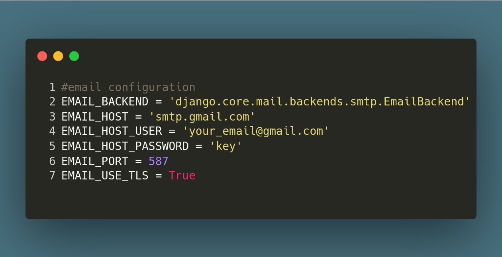
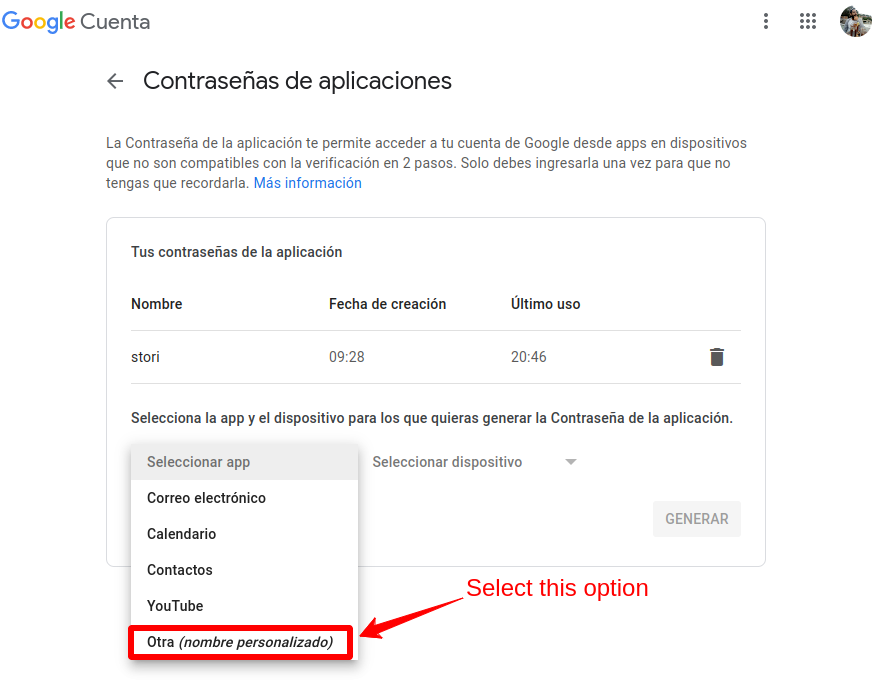
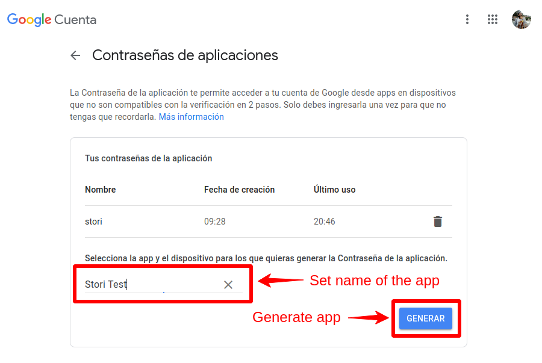
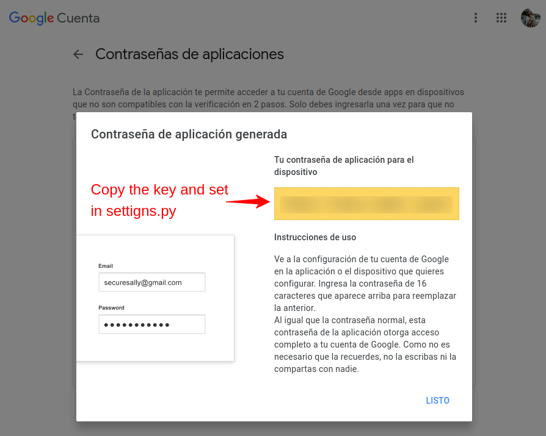
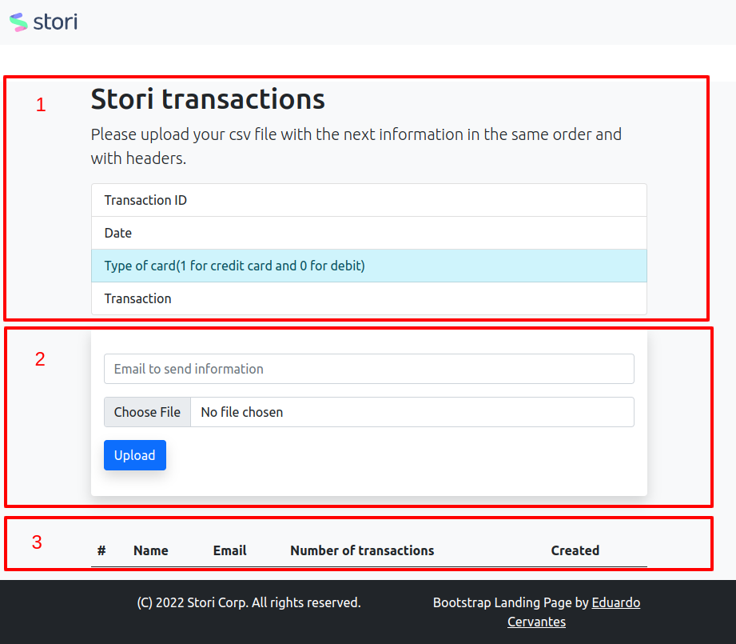
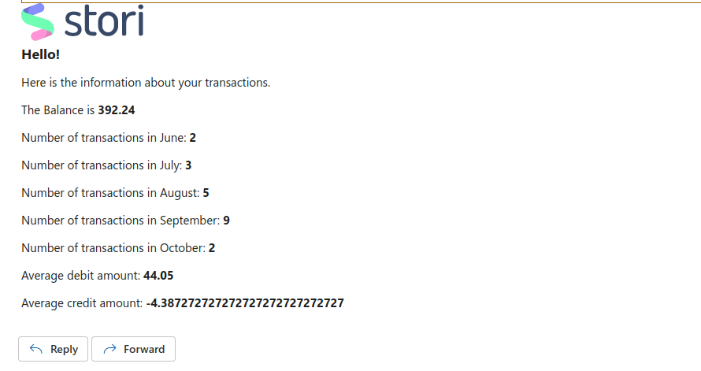

# Stori test make with python and Django.

## Requirements.

- Internet
- Docker
- Terminal

## Instructions

### Pull and start the docker containers.

```SHELL
docker-compose up
```
### Make the migrations(optional).

```SHELL
docker-compose run web python manage.py makemigrations
```

### Run migrations.

```SHELL
docker-compose run web python manage.py migrate
```

> Note: In case, that you have problems with permissions please run the follow commad.
```SHELL
sudo chown -R $USER:$USER stori transactions manage.py
```

### Setup the email configurations.

Open [settings.py](./stori/settings.py) and go to the bottom until email settings.



In the `EMAIL_HOST_USER` puts your gmail, in the `EMAIL_HOST_PASSWORD` you need to create a new key for you account, go to this [link](https://security.google.com/settings/security/apppasswords)
create a new app and copy the key that is generated and puts in that enviroment variable.

#### Step 1



#### Step 2



#### Step 3



### Enjoy :D

Go to link [http://0.0.0.0:3000](http://0.0.0.0:3000)

## Description

### Platform

We have a small web page with 3 contents that is descripted below.



#### 1 Instructions
In this content we have the instructions that we need to follow to run the web page, in addition we have a [transaction.csv file example](./transactions.csv).

#### 2 Form
This is the main content, in this content we have two fields the email that you whant to send the information and the file field to get the csv from you computer.

#### 3 Table
In this case I crate a table to show the attempts that you submit the form with information like the id, Name of the file, email, number of transactions, and the time since the record was created.


## Code

I created an app called transactinons in this case I will focus in 4 pahts of the project.

- ./transactions/models
- ./transactions/service/transactions_service.py
- ./transactions/templates
- ./transactions/views.py

### 1 Models

I created two models one for details of the file update called `Update`, and another model called `Transaction` in this model I save all transactions related with the file updated.

### 2 Service

This is the main logic of the app in this file I manage the amounts, average and dates of the transactions the main method is `save_transactions`.

### 3 Templates

I create a couple of templates `index.html` and `email` the first one was presented and the email template we have some information like this.



### 4 Views

In this case, the `views.py` is like the controller for Django, in this part I created two methods `index` in this method I just get all Update records created to present in `index.html` and, `save` method for my case is the logic to save the information of the transactions and send the email through email.